```python
import pandas as pd
data = pd.read_csv('german_credit_data.csv')
```


```python
print(data.head())
print(data.info())  
print(data.describe())  
```

       Unnamed: 0  Age     Sex  Job Housing Saving accounts Checking account  \
    0           0   67    male    2     own             NaN           little   
    1           1   22  female    2     own          little         moderate   
    2           2   49    male    1     own          little              NaN   
    3           3   45    male    2    free          little           little   
    4           4   53    male    2    free          little           little   
    
       Credit amount  Duration              Purpose  Risk  
    0           1169         6             radio/TV  good  
    1           5951        48             radio/TV   bad  
    2           2096        12            education  good  
    3           7882        42  furniture/equipment  good  
    4           4870        24                  car   bad  
    <class 'pandas.core.frame.DataFrame'>
    RangeIndex: 1000 entries, 0 to 999
    Data columns (total 11 columns):
     #   Column            Non-Null Count  Dtype 
    ---  ------            --------------  ----- 
     0   Unnamed: 0        1000 non-null   int64 
     1   Age               1000 non-null   int64 
     2   Sex               1000 non-null   object
     3   Job               1000 non-null   int64 
     4   Housing           1000 non-null   object
     5   Saving accounts   817 non-null    object
     6   Checking account  606 non-null    object
     7   Credit amount     1000 non-null   int64 
     8   Duration          1000 non-null   int64 
     9   Purpose           1000 non-null   object
     10  Risk              1000 non-null   object
    dtypes: int64(5), object(6)
    memory usage: 86.1+ KB
    None
            Unnamed: 0          Age          Job  Credit amount     Duration
    count  1000.000000  1000.000000  1000.000000    1000.000000  1000.000000
    mean    499.500000    35.546000     1.904000    3271.258000    20.903000
    std     288.819436    11.375469     0.653614    2822.736876    12.058814
    min       0.000000    19.000000     0.000000     250.000000     4.000000
    25%     249.750000    27.000000     2.000000    1365.500000    12.000000
    50%     499.500000    33.000000     2.000000    2319.500000    18.000000
    75%     749.250000    42.000000     2.000000    3972.250000    24.000000
    max     999.000000    75.000000     3.000000   18424.000000    72.000000
    


```python
data.drop(columns=['Unnamed: 0'], inplace=True) 
```


```python
data.isnull().sum()
```


    Age                   0
    Sex                   0
    Job                   0
    Housing               0
    Saving accounts     183
    Checking account    394
    Credit amount         0
    Duration              0
    Purpose               0
    Risk                  0
    dtype: int64


```python
data['Saving accounts'].fillna('No Account', inplace=True)
data['Checking account'].fillna('No Account', inplace=True)
```


```python
import matplotlib.pyplot as plt
import seaborn as sns
```


```python
plt.figure(figsize=(6, 4))
sns.countplot(x='Sex', data=data, palette='Set3')
plt.title('Distribution of Sex')
plt.show()
```


    
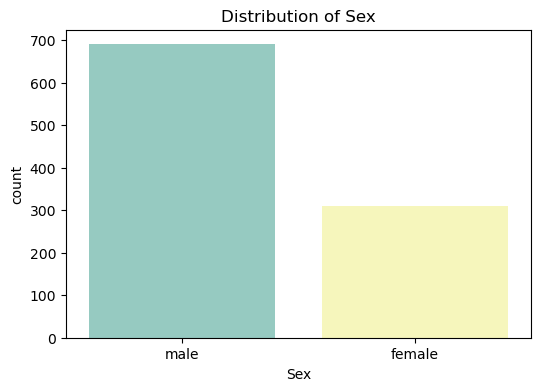
    


```python
plt.figure(figsize=(6, 4))
sns.countplot(x='Housing', data=data, palette='Set2')
plt.title('Distribution of Housing')
plt.xticks(rotation=45)
plt.show()
```


    
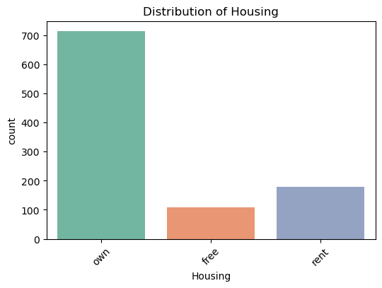
    


```python
plt.figure(figsize=(8, 6))
sns.countplot(x='Saving accounts', data=data, palette='viridis')
plt.title('Distribution of Saving Accounts')
plt.xticks(rotation=45) 
plt.show()
```


    
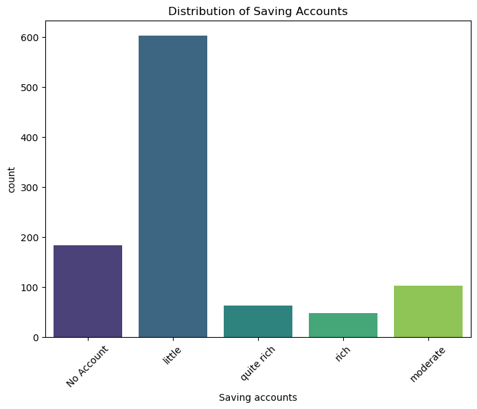
    


```python
plt.figure(figsize=(8, 4))
sns.countplot(x='Checking account', data=data, palette='Set1')
plt.title('Distribution of Checking Accounts')
plt.xticks(rotation=45)
plt.show()
```


    
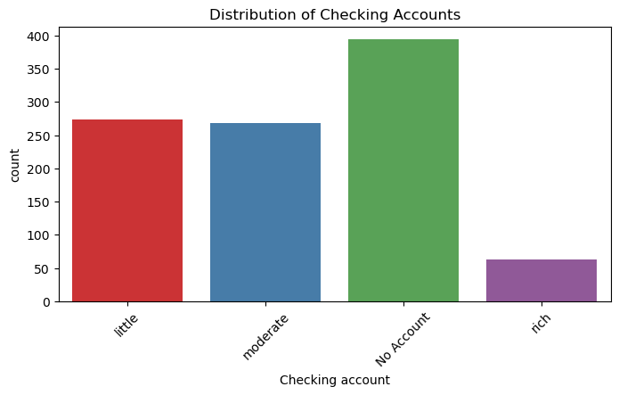
    


```python
plt.figure(figsize=(6, 4))
sns.countplot(x='Risk', data=data, palette='coolwarm')
plt.title('Distribution of Risk (Good/Bad)')
plt.show()
```


    
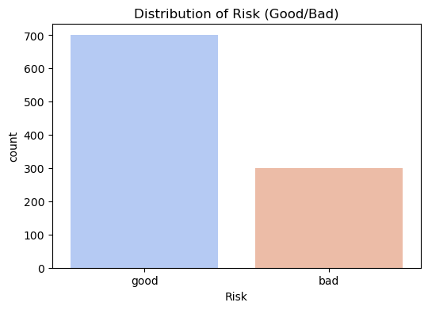
    


```python
plt.figure(figsize=(6, 4))
sns.countplot(x='Sex', hue='Risk', data=data, palette='coolwarm')
plt.title('Risk Distribution by Sex')
plt.show()
```


    
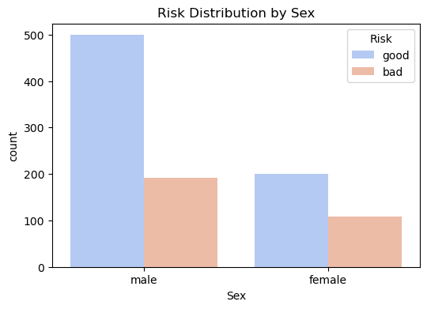
    


```python
plt.figure(figsize=(6, 4))
sns.countplot(x='Housing', hue='Risk', data=data, palette='coolwarm')
plt.title('Risk Distribution by Housing')
plt.xticks(rotation=45)
plt.show()
```


    
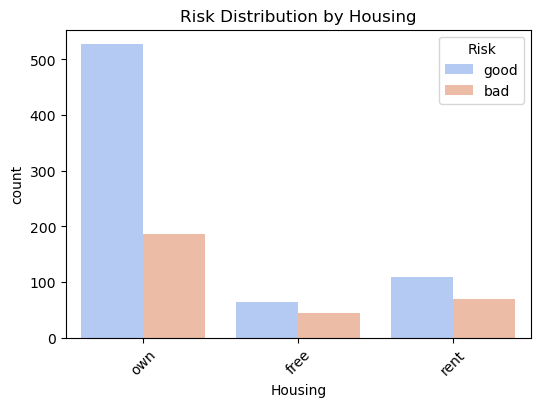
    


```python
plt.figure(figsize=(8, 4))
sns.countplot(x='Saving accounts', hue='Risk', data=data, palette='coolwarm')
plt.title('Risk Distribution by Saving Accounts')
plt.xticks(rotation=45)
plt.show()
```


    
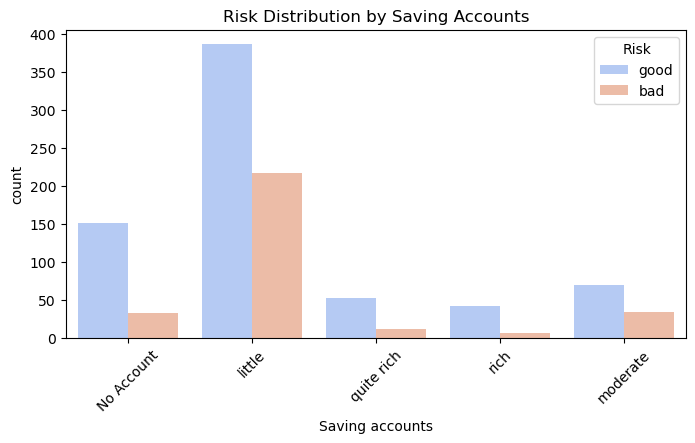
    


```python
plt.figure(figsize=(8, 4))
sns.countplot(x='Checking account', hue='Risk', data=data, palette='coolwarm')
plt.title('Risk Distribution by Checking Account')
plt.xticks(rotation=45)
plt.show()
```


    
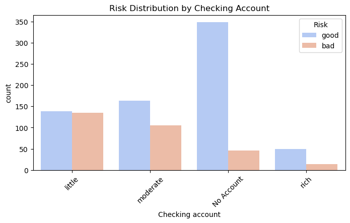
    


```python
plt.figure(figsize=(8, 6))
sns.boxplot(x='Risk', y='Age', data=data, palette='coolwarm')
plt.title('Risk Distribution by Age')
plt.show()
```


    
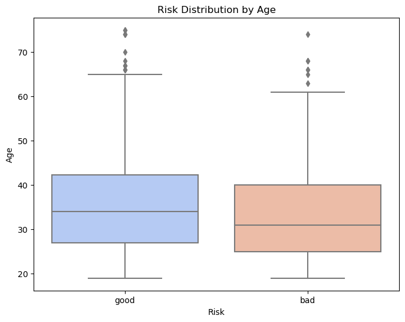
    


```python
plt.figure(figsize=(8, 6))
sns.swarmplot(x='Risk', y='Age', data=data, palette='coolwarm')
plt.title('Risk Distribution by Age (Swarm Plot)')
plt.show()
```

    C:\Users\aicha\AppData\Local\Temp\ipykernel_42288\1202468545.py:2: FutureWarning: Passing `palette` without assigning `hue` is deprecated.
      sns.swarmplot(x='Risk', y='Age', data=data, palette='coolwarm')
    c:\Users\aicha\anaconda3\lib\site-packages\seaborn\_oldcore.py:1119: FutureWarning: use_inf_as_na option is deprecated and will be removed in a future version. Convert inf values to NaN before operating instead.
      with pd.option_context('mode.use_inf_as_na', True):
    c:\Users\aicha\anaconda3\lib\site-packages\seaborn\_oldcore.py:1119: FutureWarning: use_inf_as_na option is deprecated and will be removed in a future version. Convert inf values to NaN before operating instead.
      with pd.option_context('mode.use_inf_as_na', True):
    


    
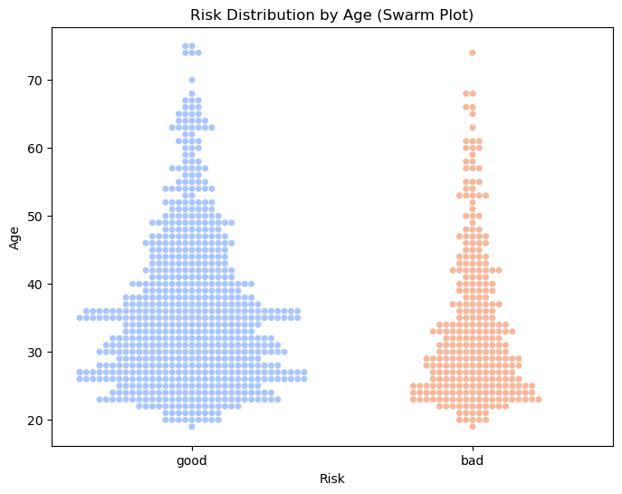
    


```python
import numpy as np

data['Saving accounts'].replace('No Account', np.nan, inplace=True)
data['Checking account'].replace('No Account', np.nan, inplace=True)
```


```python
data.head()
```


<div>
<style scoped>
    .dataframe tbody tr th:only-of-type {
        vertical-align: middle;
    }

    .dataframe tbody tr th {
        vertical-align: top;
    }

    .dataframe thead th {
        text-align: right;
    }
</style>
<table border="1" class="dataframe">
  <thead>
    <tr style="text-align: right;">
      <th></th>
      <th>Age</th>
      <th>Sex</th>
      <th>Job</th>
      <th>Housing</th>
      <th>Saving accounts</th>
      <th>Checking account</th>
      <th>Credit amount</th>
      <th>Duration</th>
      <th>Purpose</th>
      <th>Risk</th>
    </tr>
  </thead>
  <tbody>
    <tr>
      <th>0</th>
      <td>67</td>
      <td>male</td>
      <td>2</td>
      <td>own</td>
      <td>NaN</td>
      <td>little</td>
      <td>1169</td>
      <td>6</td>
      <td>radio/TV</td>
      <td>good</td>
    </tr>
    <tr>
      <th>1</th>
      <td>22</td>
      <td>female</td>
      <td>2</td>
      <td>own</td>
      <td>little</td>
      <td>moderate</td>
      <td>5951</td>
      <td>48</td>
      <td>radio/TV</td>
      <td>bad</td>
    </tr>
    <tr>
      <th>2</th>
      <td>49</td>
      <td>male</td>
      <td>1</td>
      <td>own</td>
      <td>little</td>
      <td>NaN</td>
      <td>2096</td>
      <td>12</td>
      <td>education</td>
      <td>good</td>
    </tr>
    <tr>
      <th>3</th>
      <td>45</td>
      <td>male</td>
      <td>2</td>
      <td>free</td>
      <td>little</td>
      <td>little</td>
      <td>7882</td>
      <td>42</td>
      <td>furniture/equipment</td>
      <td>good</td>
    </tr>
    <tr>
      <th>4</th>
      <td>53</td>
      <td>male</td>
      <td>2</td>
      <td>free</td>
      <td>little</td>
      <td>little</td>
      <td>4870</td>
      <td>24</td>
      <td>car</td>
      <td>bad</td>
    </tr>
  </tbody>
</table>
</div>


```python
bins = [18, 30, 40, 50, 60, 70, 100]
labels = ['18-30', '31-40', '41-50', '51-60', '61-70', '70+']
data['Age_group'] = pd.cut(data['Age'], bins=bins, labels=labels)

saving_mode = data.groupby(['Risk', 'Housing', 'Age_group'])['Saving accounts'].apply(lambda x: x.mode()[0] if not x.mode().empty else None)
checking_mode = data.groupby(['Risk', 'Housing', 'Age_group'])['Checking account'].apply(lambda x: x.mode()[0] if not x.mode().empty else None)

print(saving_mode)
print(checking_mode)
```

    Risk  Housing  Age_group
    bad   free     18-30          little
                   31-40          little
                   41-50          little
                   51-60          little
                   61-70          little
                   70+            little
          own      18-30          little
                   31-40          little
                   41-50          little
                   51-60          little
                   61-70          little
                   70+               NaN
          rent     18-30          little
                   31-40          little
                   41-50          little
                   51-60          little
                   61-70        moderate
                   70+               NaN
    good  free     18-30          little
                   31-40          little
                   41-50          little
                   51-60          little
                   61-70          little
                   70+            little
          own      18-30          little
                   31-40          little
                   41-50          little
                   51-60          little
                   61-70          little
                   70+            little
          rent     18-30          little
                   31-40          little
                   41-50          little
                   51-60          little
                   61-70          little
                   70+               NaN
    Name: Saving accounts, dtype: object
    Risk  Housing  Age_group
    bad   free     18-30          little
                   31-40        moderate
                   41-50        moderate
                   51-60          little
                   61-70          little
                   70+          moderate
          own      18-30        moderate
                   31-40          little
                   41-50          little
                   51-60          little
                   61-70          little
                   70+               NaN
          rent     18-30          little
                   31-40          little
                   41-50          little
                   51-60        moderate
                   61-70        moderate
                   70+               NaN
    good  free     18-30        moderate
                   31-40          little
                   41-50          little
                   51-60          little
                   61-70        moderate
                   70+            little
          own      18-30        moderate
                   31-40        moderate
                   41-50        moderate
                   51-60          little
                   61-70          little
                   70+            little
          rent     18-30          little
                   31-40        moderate
                   41-50          little
                   51-60          little
                   61-70          little
                   70+               NaN
    Name: Checking account, dtype: object
    

    C:\Users\aicha\AppData\Local\Temp\ipykernel_42288\16853584.py:5: FutureWarning: The default of observed=False is deprecated and will be changed to True in a future version of pandas. Pass observed=False to retain current behavior or observed=True to adopt the future default and silence this warning.
      saving_mode = data.groupby(['Risk', 'Housing', 'Age_group'])['Saving accounts'].apply(lambda x: x.mode()[0] if not x.mode().empty else None)
    C:\Users\aicha\AppData\Local\Temp\ipykernel_42288\16853584.py:6: FutureWarning: The default of observed=False is deprecated and will be changed to True in a future version of pandas. Pass observed=False to retain current behavior or observed=True to adopt the future default and silence this warning.
      checking_mode = data.groupby(['Risk', 'Housing', 'Age_group'])['Checking account'].apply(lambda x: x.mode()[0] if not x.mode().empty else None)
    


```python
for index, row in data.iterrows():
    if pd.isnull(row['Saving accounts']):
        mode_value = saving_mode.get((row['Risk'], row['Housing'], row['Age_group']), 'moderate')
        data.at[index, 'Saving accounts'] = mode_value

for index, row in data.iterrows():
    if pd.isnull(row['Checking account']):
        mode_value = checking_mode.get((row['Risk'], row['Housing'], row['Age_group']), 'little')
        data.at[index, 'Checking account'] = mode_value
```


```python
print(data[['Saving accounts', 'Checking account']].isnull().sum())
```

    Saving accounts     0
    Checking account    0
    dtype: int64
    


```python
data.head()
```


<div>
<style scoped>
    .dataframe tbody tr th:only-of-type {
        vertical-align: middle;
    }

    .dataframe tbody tr th {
        vertical-align: top;
    }

    .dataframe thead th {
        text-align: right;
    }
</style>
<table border="1" class="dataframe">
  <thead>
    <tr style="text-align: right;">
      <th></th>
      <th>Age</th>
      <th>Sex</th>
      <th>Job</th>
      <th>Housing</th>
      <th>Saving accounts</th>
      <th>Checking account</th>
      <th>Credit amount</th>
      <th>Duration</th>
      <th>Purpose</th>
      <th>Risk</th>
      <th>Age_group</th>
    </tr>
  </thead>
  <tbody>
    <tr>
      <th>0</th>
      <td>67</td>
      <td>male</td>
      <td>2</td>
      <td>own</td>
      <td>little</td>
      <td>little</td>
      <td>1169</td>
      <td>6</td>
      <td>radio/TV</td>
      <td>good</td>
      <td>61-70</td>
    </tr>
    <tr>
      <th>1</th>
      <td>22</td>
      <td>female</td>
      <td>2</td>
      <td>own</td>
      <td>little</td>
      <td>moderate</td>
      <td>5951</td>
      <td>48</td>
      <td>radio/TV</td>
      <td>bad</td>
      <td>18-30</td>
    </tr>
    <tr>
      <th>2</th>
      <td>49</td>
      <td>male</td>
      <td>1</td>
      <td>own</td>
      <td>little</td>
      <td>moderate</td>
      <td>2096</td>
      <td>12</td>
      <td>education</td>
      <td>good</td>
      <td>41-50</td>
    </tr>
    <tr>
      <th>3</th>
      <td>45</td>
      <td>male</td>
      <td>2</td>
      <td>free</td>
      <td>little</td>
      <td>little</td>
      <td>7882</td>
      <td>42</td>
      <td>furniture/equipment</td>
      <td>good</td>
      <td>41-50</td>
    </tr>
    <tr>
      <th>4</th>
      <td>53</td>
      <td>male</td>
      <td>2</td>
      <td>free</td>
      <td>little</td>
      <td>little</td>
      <td>4870</td>
      <td>24</td>
      <td>car</td>
      <td>bad</td>
      <td>51-60</td>
    </tr>
  </tbody>
</table>
</div>


```python
variable_types = data.dtypes

categorical_vars = data.select_dtypes(include=['object']).columns
unique_values = {col: data[col].unique() for col in categorical_vars}

print("Variable Types:")
print(variable_types)
print("\nUnique Values in Categorical Variables:")
for col, values in unique_values.items():
    print(f"{col}: {values}")
```

    Variable Types:
    Age                    int64
    Sex                   object
    Job                    int64
    Housing               object
    Saving accounts       object
    Checking account      object
    Credit amount          int64
    Duration               int64
    Purpose               object
    Risk                  object
    Age_group           category
    dtype: object
    
    Unique Values in Categorical Variables:
    Sex: ['male' 'female']
    Housing: ['own' 'free' 'rent']
    Saving accounts: ['little' 'quite rich' 'rich' 'moderate']
    Checking account: ['little' 'moderate' 'rich']
    Purpose: ['radio/TV' 'education' 'furniture/equipment' 'car' 'business'
     'domestic appliances' 'repairs' 'vacation/others']
    Risk: ['good' 'bad']
    


```python
# Label Encoding
# Sex: male = 0, female = 1
data['Sex'] = data['Sex'].map({'male': 0, 'female': 1})

# Housing: rent = 0, free = 1, own = 2
data['Housing'] = data['Housing'].map({'rent': 0, 'free': 1, 'own': 2})

# Saving accounts: little = 0, moderate = 1, quite rich = 2, rich = 3
data['Saving accounts'] = data['Saving accounts'].map({'little': 0, 'moderate': 1, 'quite rich': 2, 'rich': 3})

# Checking account: little = 0, moderate = 1, rich = 2
data['Checking account'] = data['Checking account'].map({'little': 0, 'moderate': 1, 'rich': 2})

# Purpose: Assigning values (0 for least expensive upwards)
purpose_mapping = {
    'radio/TV': 0, 
    'education': 5, 
    'furniture/equipment': 1, 
    'car': 6, 
    'business': 7, 
    'domestic appliances': 2, 
    'repairs': 3, 
    'vacation/others': 4
}
data['Purpose'] = data['Purpose'].map(purpose_mapping)

# Risk: good = 1, bad = 0
data['Risk'] = data['Risk'].map({'good': 1, 'bad': 0})

print("\nEncoded DataFrame with Label Encoding:")
print(data.head()) 
```

    
    Encoded DataFrame with Label Encoding:
       Age  Sex  Job  Housing  Saving accounts  Checking account  Credit amount  \
    0   67    0    2        2                0                 0           1169   
    1   22    1    2        2                0                 1           5951   
    2   49    0    1        2                0                 1           2096   
    3   45    0    2        1                0                 0           7882   
    4   53    0    2        1                0                 0           4870   
    
       Duration  Purpose  Risk Age_group  
    0         6        0     1     61-70  
    1        48        0     0     18-30  
    2        12        5     1     41-50  
    3        42        1     1     41-50  
    4        24        6     0     51-60  
    

Explanation of Encoding

Sex: male = 0 , female = 1

Housing: rent = 0 , free = 1 , own = 2 

Saving accounts: , little = 0 , moderate = 1 , quite rich = 2 , rich = 3

Checking account: little = 0 , moderate = 1 , rich = 2

Purpose: Assigned values are based on the order of expense (from least to most expensive):

radio/TV: 0 , furniture/equipment: 1 , domestic appliances: 2 , repairs: 3 , vacation/others: 4 , education: 5 , car: 6 , business: 7
     
Risk: good = 1 , bad = 0


```python
data.head()
```


<div>
<style scoped>
    .dataframe tbody tr th:only-of-type {
        vertical-align: middle;
    }

    .dataframe tbody tr th {
        vertical-align: top;
    }

    .dataframe thead th {
        text-align: right;
    }
</style>
<table border="1" class="dataframe">
  <thead>
    <tr style="text-align: right;">
      <th></th>
      <th>Age</th>
      <th>Sex</th>
      <th>Job</th>
      <th>Housing</th>
      <th>Saving accounts</th>
      <th>Checking account</th>
      <th>Credit amount</th>
      <th>Duration</th>
      <th>Purpose</th>
      <th>Risk</th>
      <th>Age_group</th>
    </tr>
  </thead>
  <tbody>
    <tr>
      <th>0</th>
      <td>67</td>
      <td>0</td>
      <td>2</td>
      <td>2</td>
      <td>0</td>
      <td>0</td>
      <td>1169</td>
      <td>6</td>
      <td>0</td>
      <td>1</td>
      <td>61-70</td>
    </tr>
    <tr>
      <th>1</th>
      <td>22</td>
      <td>1</td>
      <td>2</td>
      <td>2</td>
      <td>0</td>
      <td>1</td>
      <td>5951</td>
      <td>48</td>
      <td>0</td>
      <td>0</td>
      <td>18-30</td>
    </tr>
    <tr>
      <th>2</th>
      <td>49</td>
      <td>0</td>
      <td>1</td>
      <td>2</td>
      <td>0</td>
      <td>1</td>
      <td>2096</td>
      <td>12</td>
      <td>5</td>
      <td>1</td>
      <td>41-50</td>
    </tr>
    <tr>
      <th>3</th>
      <td>45</td>
      <td>0</td>
      <td>2</td>
      <td>1</td>
      <td>0</td>
      <td>0</td>
      <td>7882</td>
      <td>42</td>
      <td>1</td>
      <td>1</td>
      <td>41-50</td>
    </tr>
    <tr>
      <th>4</th>
      <td>53</td>
      <td>0</td>
      <td>2</td>
      <td>1</td>
      <td>0</td>
      <td>0</td>
      <td>4870</td>
      <td>24</td>
      <td>6</td>
      <td>0</td>
      <td>51-60</td>
    </tr>
  </tbody>
</table>
</div>


```python
import pandas as pd
import numpy as np
import matplotlib.pyplot as plt
import seaborn as sns
from sklearn.model_selection import train_test_split
from sklearn.preprocessing import StandardScaler
from sklearn.linear_model import LogisticRegression
from sklearn.metrics import classification_report, confusion_matrix

data = data.drop('Age_group', axis=1)

# 1. Data Preparation
X = data.drop('Risk', axis=1)  # All columns except 'Risk'
y = data['Risk']  # Target variable

X_train, X_test, y_train, y_test = train_test_split(X, y, test_size=0.2, random_state=42)

# 2. Feature Scaling
scaler = StandardScaler()
X_train = scaler.fit_transform(X_train)
X_test = scaler.transform(X_test)

# 3. Model Training
model = LogisticRegression()  
model.fit(X_train, y_train)

# 4. Prediction
y_pred = model.predict(X_test)

# 5. Evaluation
print("Confusion Matrix:")
print(confusion_matrix(y_test, y_pred))

print("\nClassification Report:")
print(classification_report(y_test, y_pred))

# 6. Visualization
plt.figure(figsize=(12, 6))

predictions_df = pd.DataFrame({'Actual': y_test, 'Predicted': y_pred})

actual_counts = predictions_df['Actual'].value_counts().sort_index()
predicted_counts = predictions_df['Predicted'].value_counts().sort_index()

bar_width = 0.35
x = np.arange(len(actual_counts))

plt.bar(x - bar_width/2, actual_counts, width=bar_width, label='Actual', color='blue', alpha=0.7)
plt.bar(x + bar_width/2, predicted_counts, width=bar_width, label='Predicted', color='orange', alpha=0.7)

plt.title('Actual vs Predicted Risk')
plt.ylabel('Count')
plt.xlabel('Risk')
plt.xticks(x, ['Bad (0)', 'Good (1)'])
plt.legend()
plt.grid(axis='y')

plt.show()
```

    Confusion Matrix:
    [[ 14  45]
     [ 14 127]]
    
    Classification Report:
                  precision    recall  f1-score   support
    
               0       0.50      0.24      0.32        59
               1       0.74      0.90      0.81       141
    
        accuracy                           0.70       200
       macro avg       0.62      0.57      0.57       200
    weighted avg       0.67      0.70      0.67       200
    
    


    

    

